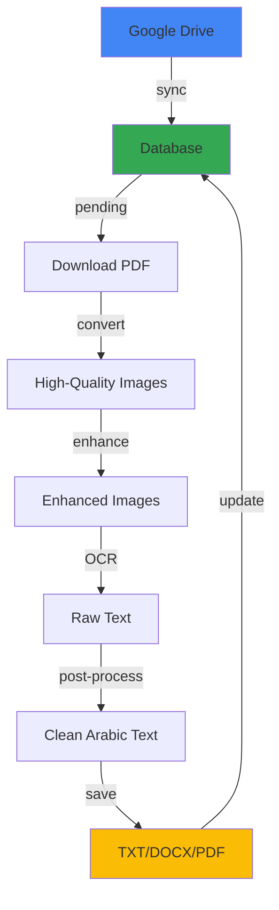

# نظام OCR للمستندات القانونية العربية - نظرة عامة

## 📋 ملخص المشروع

نظام متكامل وعالي الأداء لتحويل **أكثر من 100,000 ملف PDF** من المستندات القانونية العربية إلى نصوص رقمية قابلة للبحث والتحرير. النظام مُحسّن للعمل على خوادم GPU بقدرة 40GB مع ذاكرة RAM 256GB.

## 🎯 المشكلة والحل

### المشكلة
- 100,000+ ملف PDF من مستندات قانونية عربية
- حاجة لدقة عالية جداً (أي خطأ قد يغير المعنى القانوني)
- معالجة يدوية ستستغرق سنوات
- النصوص تحتوي على أرقام، تواريخ، جداول معقدة
- نصوص مختلطة (عربي/إنجليزي)

### الحل
نظام OCR متقدم يستخدم:
- **PaddleOCR** مع تحسينات خاصة للعربية
- **معالجة موزعة** Multi-processing
- **GPU acceleration** لسرعة قصوى
- **معالجة ذكية** للنصوص العربية القانونية
- **نظام تتبع وإدارة** مع قاعدة بيانات

## 🏗️ البنية التقنية

### الطبقات الرئيسية

```
┌─────────────────────────────────────┐
│         Google Drive API            │  ← مزامنة الملفات
├─────────────────────────────────────┤
│      PDF Processing Layer           │  ← تحويل PDF لصور
│  (PyMuPDF + pdf2image + OpenCV)    │     عالية الجودة
├─────────────────────────────────────┤
│         OCR Engine Layer            │  ← استخراج النص
│    (PaddleOCR + GPU Acceleration)  │     بدقة عالية
├─────────────────────────────────────┤
│   Arabic Post-Processing Layer      │  ← تصحيح وتحسين
│   (تصحيح أخطاء + تنسيق + تحقق)     │     النص العربي
├─────────────────────────────────────┤
│      Output Generation Layer        │  ← حفظ النتائج
│         (TXT, DOCX, PDF)            │     بصيغ متعددة
├─────────────────────────────────────┤
│    Database & Tracking Layer        │  ← إدارة وتتبع
│         (SQLite + Logging)          │     المعالجة
└─────────────────────────────────────┘
```

### المكونات الأساسية

#### 1. **Google Drive Handler** (`google_drive_handler.py`)
- مزامنة تلقائية مع Drive
- تنزيل دفعي مُحسّن
- معالجة 100K+ ملف بكفاءة

#### 2. **PDF Processor** (`pdf_processor.py`)
- تحويل PDF → صور بدقة 300-400 DPI
- معالجة مسبقة متقدمة:
  - Denoising (إزالة الضوضاء)
  - Deskewing (تصحيح الانحراف)
  - Contrast Enhancement (تحسين التباين)
  - Binarization (تحويل لأبيض وأسود)
- كشف الجداول والتخطيطات المعقدة

#### 3. **OCR Engine** (`ocr_engine.py`)
- PaddleOCR كمحرك أساسي (أفضل للعربية)
- EasyOCR كاحتياطي
- Tesseract للحالات الخاصة
- دعم GPU الكامل
- معالجة دفعية Batch Processing
- قياس معدلات الثقة Confidence

#### 4. **Arabic Post-Processor** (`arabic_postprocessor.py`)
- تصحيح الأخطاء الشائعة في OCR العربي
- توحيد الأرقام (عربي/هندي → موحد)
- إصلاح الحروف المتصلة (ligatures)
- تصحيح المسافات والتنسيق
- استخراج أرقام المواد والبنود القانونية
- استخراج التواريخ
- معالجة النصوص ثنائية الاتجاه BiDi

#### 5. **Database System** (`database.py`)
- تتبع حالة كل ملف
- إحصائيات شاملة
- استكمال تلقائي بعد الانقطاع
- نظام إعادة محاولة للملفات الفاشلة

## ⚡ الأداء والكفاءة

### المواصفات المُستهدفة
- **الخادم**: GPU 40GB + RAM 256GB
- **السرعة**: 10-20 ملف/دقيقة
- **الدقة**: 92-98% للنصوص الواضحة
- **الوقت المتوقع لـ 100K ملف**: 5-7 أيام

### التحسينات المطبقة

#### 1. **تحسين الذاكرة**
```python
- معالجة دفعية بحجم محدد (Batch Size)
- تنظيف تلقائي للملفات المؤقتة
- Garbage Collection دوري
- إدارة ذكية لذاكرة GPU
```

#### 2. **تحسين السرعة**
```python
- Multi-processing (4-8 workers)
- GPU Batch Processing
- تحميل موازي من Drive
- معالجة متزامنة للصور
```

#### 3. **تحسين الدقة**
```python
- DPI عالي (300-400)
- معالجة مسبقة متعددة المراحل
- تصحيح تلقائي للأخطاء
- Ensemble learning (عدة محركات)
```

## 📊 سير العمل (Workflow)



## 🔧 الإعدادات الرئيسية

### للمستندات القانونية (إعدادات موصى بها)
```python
# في config.py
IMAGE_DPI = 300                    # دقة عالية
REMOVE_DIACRITICS = False          # احتفظ بالتشكيل
VALIDATE_ARABIC = True             # تحقق من صحة النص
EXTRACT_ARTICLE_NUMBERS = True     # استخرج أرقام المواد
EXTRACT_DATES = True               # استخرج التواريخ
EXTRACT_TABLES = True              # عالج الجداول
```

### للأداء الأقصى
```python
NUM_WORKERS = 8                    # عدد العمليات المتوازية
BATCH_SIZE = 32                    # حجم الدفعة
PADDLE_GPU_MEM = 8000             # ذاكرة GPU لكل عملية
PREFETCH_COUNT = 20               # عدد الملفات المُحمّلة مسبقاً
```

## 📈 المقاييس والمراقبة

### مقاييس الأداء
- **Throughput**: عدد الملفات/الساعة
- **Processing Time**: متوسط وقت معالجة كل ملف
- **Confidence Score**: معدل ثقة OCR
- **Success Rate**: نسبة الملفات المُعالجة بنجاح

### التتبع والسجلات
```bash
logs/
├── ocr_processing.log    # السجل الرئيسي
└── errors.log            # الأخطاء فقط

ocr_tracking.db           # قاعدة البيانات
```

## 🎛️ أوضاع التشغيل

### 1. وضع التطوير (Development)
```bash
python main.py --process --limit 10
```
- معالجة عدد محدود
- سجلات مفصلة
- للاختبار السريع

### 2. وضع الإنتاج (Production)
```bash
python main.py --process --workers 8 --batch-size 32
```
- أقصى أداء
- معالجة مستمرة
- استكمال تلقائي

### 3. وضع الاستكمال (Resume)
```bash
python main.py --process
```
- يكمل من حيث توقف
- يعيد محاولة الملفات الفاشلة
- آمن للمقاطعة

## 🔒 الأمان والموثوقية

### نقاط القوة
- ✅ **لا فقدان للبيانات**: كل شيء مُتتبع في قاعدة البيانات
- ✅ **استكمال تلقائي**: يمكن إيقاف وإعادة تشغيل في أي وقت
- ✅ **إعادة محاولة ذكية**: للملفات التي فشلت
- ✅ **عزل الأخطاء**: ملف واحد فاشل لا يوقف المعالجة
- ✅ **سجلات شاملة**: لكل خطوة ومشكلة

### معالجة الأخطاء
```python
try:
    process_file()
except Exception:
    - تسجيل الخطأ
    - تحديث حالة الملف
    - الانتقال للملف التالي
    - جدولة إعادة محاولة
```

## 📦 المخرجات

لكل ملف PDF، ينتج النظام:

### 1. ملف نصي (.txt)
```
المادة 1: يهدف هذا القانون إلى...

--- Page Break ---

المادة 2: تشمل أحكام هذا القانون...
```

### 2. مستند Word (.docx)
- نص منسق
- قابل للتحرير
- يحافظ على فواصل الصفحات

### 3. قاعدة البيانات
- معلومات الملف
- معدل الثقة
- الوقت المستغرق
- الصفحات منخفضة الثقة
- أي أخطاء

## 🚀 التوسع المستقبلي

### ميزات قيد التطوير
- [ ] Searchable PDF (PDF قابل للبحث)
- [ ] معالجة موزعة على عدة خوادم
- [ ] واجهة ويب لمراقبة التقدم
- [ ] API للتكامل مع أنظمة أخرى
- [ ] نماذج ML مُدربة على المستندات القانونية
- [ ] كشف تلقائي لأنواع المستندات

### تحسينات محتملة
- استخدام Redis لإدارة الطوابير
- Celery للمعالجة الموزعة
- Docker containerization
- Kubernetes للتوسع التلقائي
- تكامل مع Elasticsearch للبحث

## 📚 الموارد والمراجع

### المكتبات الأساسية
- **PaddleOCR**: https://github.com/PaddlePaddle/PaddleOCR
- **PyMuPDF**: https://pymupdf.readthedocs.io/
- **pdf2image**: https://github.com/Belval/pdf2image
- **OpenCV**: https://opencv.org/

### وثائق Google
- **Drive API**: https://developers.google.com/drive/api/v3/about-sdk
- **OAuth 2.0**: https://developers.google.com/identity/protocols/oauth2

## 💡 نصائح للاستخدام الأمثل

### 1. قبل البدء
- ✓ تأكد من توفر المساحة الكافية (100GB+ للملفات المؤقتة)
- ✓ اختبر على 10-100 ملف أولاً
- ✓ راقب استخدام GPU memory
- ✓ جهز سرعة إنترنت جيدة (للتنزيل من Drive)

### 2. أثناء المعالجة
- ✓ راقب السجلات دورياً
- ✓ تحقق من الإحصائيات كل ساعة
- ✓ راجع عينات من المخرجات للتأكد من الجودة
- ✓ احتفظ بنسخة احتياطية من قاعدة البيانات

### 3. بعد الانتهاء
- ✓ راجع الملفات الفاشلة يدوياً
- ✓ تحقق من الملفات منخفضة الثقة
- ✓ احفظ تقرير الإحصائيات النهائي
- ✓ أرشف السجلات

---

**المشروع جاهز للإنتاج** ✅

للبدء: راجع `QUICKSTART_AR.md`
للتفاصيل الكاملة: راجع `README.md`
